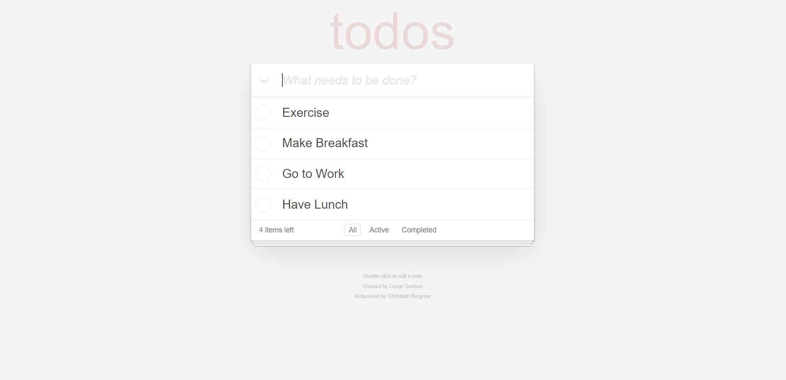

<h1>Project 8: Enhance an existing project</h1>
<ol>
    <li>Fix the bugs</li>
    <li>Add tests</li>
    <li>Analyze performance</li>
    <li>Write technical documentation</li>
</ol>

<h2>Skills:</h2>

Optimize the performance of a project using DevTools

Implement unit and functional tests in a web application

Take over an existing JavaScript project

